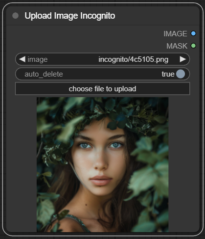

# ComfyUI-Login

This custom node uses a simple password to protect ComfyUI.

## First thing first

Please be aware that absolute security does not exist. This login node offers only basic
protection for ComfyUI. Use it at your own risk.

## How to use


## Installation

To install this node, you have two options:

1. In the directory `ComfyUI/custom_nodes/`, git clone this repo, and do `pip install -r
   requirements.txt` in the repo's directory.

2. Use [ComfyUI-Manager](https://github.com/ltdrdata/ComfyUI-Manager).

## Setting Up a New Password

For your first login, you may choose any password. This password will be encrypted and
stored in a file named `PASSWORD` within the `<ComfyUI project folder>/login` folder.

## Resetting a Forgotten Password

If you forget your password, you can reset it by deleting the `PASSWORD` file found in
the `<ComfyUI project folder>/login` folder. After doing this, you will be able to log
in again using a new password of your choice.

## Removing the Login Feature

To disable the login feature, you can either:

1. Manually delete the ComfyUI-Login folder located in the `ComfyUI/custom_nodes/`
   directory. Then, restart ComfyUI for the changes to take effect.

2. Use the [ComfyUI-Manager](https://github.com/ltdrdata/ComfyUI-Manager) to uninstall
   it.

## Using REST API Calls?

ComfyUI-Login also protects the server from unauthorized API calls.

You can find your token in your console (command line window) if you have set your
password. It'll look like this:

```text
For direct API calls, use token=$2b...
```

You have two options to validate your call:

1. Add an additional argument `token`. An example can be found in
   `./script_examples/websockets_api_example.py`.

2. Add an Authorization Bearer header. An example can be found in
   `./script_examples/free_memory.sh`

## Customizing the login page?

Feel free to modify `login.html` if you want to personalize your login page.

# Upload Image Incognito

This package now contains a node that contribute to privacy.



The image will be encrypted and uploaded to the server. The key for decryption is generated randomly each time and will never be saved on disk or on the server.

The image will be automatically deleted by default.

Unlike the default "Load Image" node, where the image is read from disk every time, this node keeps the image in cache and deletes the physical file as soon as the first prompt runs.

# Free Memory When Leaving

The browser will send a `/free` POST request to the server when the user is leaving, logging out, or refreshing the page.

This is handled purely in JavaScript. If you prefer not to use this feature, simply delete the file `js/free_memory.js`.