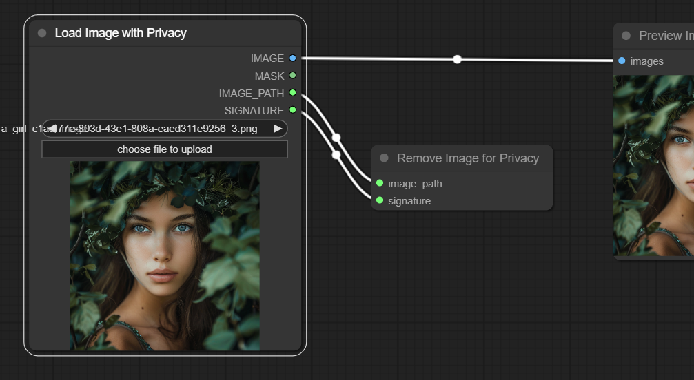

# ComfyUI-Login

This custom node uses a simple password to protect ComfyUI.

## First thing first

Please be aware that absolute security does not exist. This login node offers only basic
protection for ComfyUI. Use it at your own risk.

## How to use


## Installation

To install this node, you have two options:

1. In the directory `ComfyUI/custom_nodes/`, git clone this repo, and do `pip install -r
   requirements.txt` in the repo's directory.

2. Use [ComfyUI-Manager](https://github.com/ltdrdata/ComfyUI-Manager).

## Setting Up a New Password

For your first login, you may choose any password. This password will be encrypted and
stored in a file named `PASSWORD` within the `<ComfyUI project folder>/login` folder.

## Resetting a Forgotten Password

If you forget your password, you can reset it by deleting the `PASSWORD` file found in
the `<ComfyUI project folder>/login` folder. After doing this, you will be able to log
in again using a new password of your choice.

## Removing the Login Feature

To disable the login feature, you can either:

1. Manually delete the ComfyUI-Login folder located in the `ComfyUI/custom_nodes/`
   directory. Then, restart ComfyUI for the changes to take effect.

2. Use the [ComfyUI-Manager](https://github.com/ltdrdata/ComfyUI-Manager) to uninstall
   it.

## Using REST API Calls?

ComfyUI-Login also protects the server from unauthorized API calls.

You can find your token in your console (command line window) if you have set your
password. It'll look like this:

```text
For direct API calls, use token=$2b...
```

You have two options to validate your call:

1. Add an additional argument `token`. An example can be found in
   `./script_examples/websockets_api_example.py`.

2. Add an Authorization Bearer header. An example can be found in
   `./script_examples/free_memory.sh`

## Customizing the login page?

Feel free to modify `login.html` if you want to personalize your login page.

# Upload Privacy Nodes

This package now contains two nodes that contribute to privacy.

When using ComfyUI's API to serve customers, people often ask if the uploaded pictures will be destroyed after processing. The answer was no, and it's not easy, because there's no "remove image" node for security considerations.

Now we have two nodes for this:



1. Load Image with Privacy

This node not only loads an image, but also returns the path of the image and a calculated signature for the path.

2. Remove Image for Privacy

This node will remove the image if the signature for the path of the image is correct.

## Before Using the Nodes

Please set the `REMOVE_IMAGE_SECRET` in `upload_privacy.py`, so that your signature will be unique and secure.

These two nodes are mainly for API use, because I assume that people don't need to remove any images in the GUI. But who knows.
