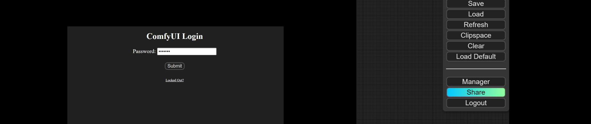

# ComfyUI-Login
This custom node uses a simple password to protect ComfyUI.

# First thing first
Please be aware that absolute security does not exist. This login node offers only basic protection for ComfyUI. Use it at your own risk.

# How to use

## Installation
To install this node, you have two options:

1. In the directory `ComfyUI/custom_nodes/`, git clone this repo, and do `pip install -r requirements.txt` in the repo's directory.

2. Use [ComfyUI-Manager](https://github.com/ltdrdata/ComfyUI-Manager). (Sorry, I haven't submitted to ComfyUI-Manager yet...)

## Setting Up a New Password
For your first login, you may choose any password. This password will be encrypted and stored in a file named "PASSWORD" within the ComfyUI project folder.

## Resetting a Forgotten Password
If you forget your password, you can reset it by deleting the "PASSWORD" file found in the ComfyUI project folder. After doing this, you will be able to log in again using a new password of your choice.

## Removing the Login Feature
To disable the login feature, you can either:

1. Manually delete the ComfyUI-Login folder located in the `ComfyUI/custom_nodes/` directory. Then, restart ComfyUI for the changes to take effect.

2. Use the [ComfyUI-Manager](https://github.com/ltdrdata/ComfyUI-Manager) to uninstall it. (Sorry, I haven't submitted to ComfyUI-Manager yet...)

## Using REST API calls?

ComfyUI-Login also protects the server from unauthorized API calls. Please add an additional argument `token` to your request to validate the call.

You'll find your token in your console (command line window) if you've set your password.

An example can be found in `./script_examples/websockets_api_example.py`.

## Customizing the login page?

Feel free to modify `login.html` if you want to personalize your login page.

## HTTPS?
Now ComfyUI officially supports HTTPS. Please check [How To Use TLS/SSL](https://github.com/comfyanonymous/ComfyUI?tab=readme-ov-file#how-to-use-tlsssl) section.
